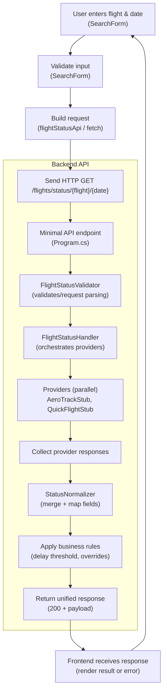

# FlightStatusChecker — Submission

FlightStatusChecker is a small monorepo that implements a flight status lookup service with a .NET backend and a Vite + React TypeScript frontend. The backend aggregates responses from provider implementations (stubs by default), normalizes business rules (15-minute delay rule, Cancelled/Diverted overrides), and exposes a simple API consumed by the frontend.

This README explains the project purpose, specification highlights, folder layout, and step-by-step setup and test instructions for both backend and frontend environments so an examiner can reproduce and evaluate the project.

## Key Specifications (summary)
- Query API: GET /flights/status/{flightNumber}/{date} where `date` = `yyyy-MM-dd` (UTC calendar date).
- Unified response model: `OnTime | Delayed | Cancelled | Diverted | Unknown` with optional provider-specific fields (Terminal, Gate, StatusReason).
- Business rules:
	- Delay => estimated - scheduled >= 15 minutes
	- Cancelled/Diverted override any OnTime/Delayed result
	- If all providers fail, return 200 with `status: Unknown`

## Tech stack
- Backend: .NET 8 (C#), ASP.NET Core minimal APIs
- Frontend: Vite + React + TypeScript
- Tests: xUnit / dotnet test for backend, Jest + React Testing Library for frontend

## Folder structure (top-level)
- `FlightStatusBackend/` - .NET backend project and related code (Program.cs, Services, Providers, Models)
- `FlightStatus.Tests/` - backend unit tests
- `FlightStatusFrontend/` - Vite + React TypeScript frontend (components, services, tests)
- Other docs: `spec.md`, `IMPLEMENTATION_GUIDE.md`, `prompts.md`, `copilot-instructions.md`

See the repository for full details of each folder.

---

## Backend — Setup & Run

Prerequisites
- .NET 8 SDK installed and on `PATH` (verify with `dotnet --info`)

Steps
1. Open a terminal in the repo root.
2. Restore and build:

```powershell
cd FlightStatusBackend
dotnet restore
dotnet build
```

3. Run the backend (development):

```powershell
dotnet run --launch-profile https
```

By default the backend uses the Kestrel server and will print the listening URL (e.g., `https://localhost:5001`). Use that URL for the frontend API base.

Configuration
- App settings are in `FlightStatusBackend/appsettings.json` and `appsettings.Development.json` for local overrides.
- Stubs/providers are registered in `Program.cs`. To toggle between real providers and stubs, use the DI registration or environment-specific configuration.

Backend tests

From the repo root run:

```powershell
dotnet test FlightStatus.Tests
```

Troubleshooting
- If you see runtime/mismatch errors (CoreCLR startup or HTTP 500.31):
	- Delete `bin/` and `obj/` directories then `dotnet restore` and `dotnet build`.
	- Ensure the machine has .NET 8 runtime installed (matching `<TargetFramework>`).

---

## Frontend — Setup & Run

Prerequisites
- Node.js (recommended v18 or later) and npm

Steps
1. Change directory to the frontend:

```powershell
cd FlightStatusFrontend
```

2. Install dependencies and run the dev server:

```powershell
npm install
npm run dev
```

3. By default Vite runs on `http://localhost:5173`. The frontend expects the backend API base to be set via `API_BASE` (or uses a development proxy configured in `vite.config.js`).

Environment file
- Create a `.env` in `FlightStatusFrontend` if you want to set the API URL explicitly:

```
API_BASE=https://localhost:5001
```

Frontend tests

```powershell
npm test
```

Notes
- Tests run under Jest/ts-jest. Some code paths use `import.meta.env` at runtime; for tests the code contains fallbacks so Jest can run without Vite runtime. If tests complain about types, run `npm install` and ensure `ts-jest` is configured in `jest.config.ts`.

---

## API Examples

Request

```
GET /flights/status/AA123/2026-06-09
Host: localhost:5001
```

Example Response (200)

```json
{
	"flightNumber": "AA123",
	"date": "2026-06-09",
	"status": "Delayed",
	"scheduledDepartureUtc": "2026-06-09T10:00:00Z",
	"estimatedDepartureUtc": "2026-06-09T10:25:00Z",
	"terminal": "T1",
	"gate": "A12",
	"statusReason": "Late arrival of inbound aircraft"
}
```

Behavior notes
- API returns `200` even if providers fail; `status` will be `Unknown` per the project's decision rules.

---

## Testing with pre-existing data (stubs)

If you want to exercise the API quickly using the built-in provider stubs, follow these steps — no external provider or seed data required.

- Start the backend (it uses stub providers by default):

```powershell
cd FlightStatusBackend
dotnet run --launch-profile https
```

- Use `curl` (or your browser / Postman) to query a known flight. Example:

```bash
curl -k "https://localhost:5001/flights/status/AA100/2026-06-09"
```

- Example successful response (stubbed data):

```json
{
	"flightNumber": "AA100",
	"date": "2026-06-09",
	"status": "OnTime",
	"scheduledDepartureUtc": "2026-06-09T10:00:00Z",
	"actualDepartureUtc": null,
	"terminal": "T1",
	"gate": "A1",
	"statusReason": null
}
```

- Stub flight numbers available for testing

The backend includes two stub providers that return deterministic responses for the following flight numbers. Use any date in `yyyy-MM-dd` format (the stubs use the date to build timestamps):

- `OT100` — On-time (example):

```bash
curl -k "https://localhost:5001/flights/status/OT100/2026-06-09"
```

- `DL200` — Delayed (example):

```bash
curl -k "https://localhost:5001/flights/status/DL200/2026-06-09"
```

- `UA789` — Cancelled (example):

```bash
curl -k "https://localhost:5001/flights/status/UA789/2026-06-09"
```

- `DV300` — Diverted (example):

```bash
curl -k "https://localhost:5001/flights/status/DV300/2026-06-09"
```

- `UK999` — Unknown / no reliable data (example):

```bash
curl -k "https://localhost:5001/flights/status/UK999/2026-06-09"
```

- If you prefer testing the frontend against the running backend, point the frontend to the backend URL. Options:
	- Create `FlightStatusFrontend/.env` with `VITE_API_URL=https://localhost:5001` and restart the dev server.
	- Or set the URL at runtime in the browser console before using the UI:

```js
window.VITE_API_URL = 'https://localhost:5001';
// or
globalThis.VITE_API_URL = 'https://localhost:5001';
```

- The backend stub implementations live in `FlightStatusBackend/Providers` (for example `AeroTrackStub.cs`, `QuickFlightStub.cs`). Edit those files if you want to change the sample payloads returned by the API.

These steps let an examiner or developer verify the end-to-end flow without adding external data sources.

**End-to-end Flowchart**

The diagram below shows the full request flow from the user entering data in the UI through provider responses and normalization in the backend.



**Component / file mapping**
- **Frontend UI**: [FlightStatusFrontend/src/components/SearchForm.tsx](FlightStatusFrontend/src/components/SearchForm.tsx)
- **Frontend API client**: [FlightStatusFrontend/src/services/flightStatusApi.ts](FlightStatusFrontend/src/services/flightStatusApi.ts)
- **API endpoint**: [FlightStatusBackend/Program.cs](FlightStatusBackend/Program.cs)
- **Validator**: [FlightStatusBackend/Services/FlightStatusValidator.cs](FlightStatusBackend/Services/FlightStatusValidator.cs)
- **Handler / Orchestrator**: [FlightStatusBackend/Services/FlightStatusHandler.cs](FlightStatusBackend/Services/FlightStatusHandler.cs)
- **Normalizer / Rules**: [FlightStatusBackend/Services/StatusNormalizer.cs](FlightStatusBackend/Services/StatusNormalizer.cs)
- **Stub providers**: [FlightStatusBackend/Providers/AeroTrackStub.cs](FlightStatusBackend/Providers/AeroTrackStub.cs), [FlightStatusBackend/Providers/QuickFlightStub.cs](FlightStatusBackend/Providers/QuickFlightStub.cs)

---

## Troubleshooting & Notes
- If backend fails to start: confirm `.NET 8` runtime installed and remove stale build artifacts (`bin`, `obj`).
- If frontend tests fail due to env issues: verify `jest.config.ts` and `src/styles.d.ts` are present and run `npm install`.
- To change provider behavior, edit `FlightStatusBackend/Providers` and DI registration in `Program.cs`.
---
## Frontend UI


## Backend Swagger Document


